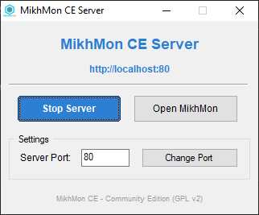

# 🚀 MikhMon CE Server Launcher

> A lightweight Windows GUI launcher for MikhMon CE, built with AutoIt. Replaces the need for Laragon, XAMPP, or any other web server software.




---

## ✨ Features

- 🖱️ **One-click server control** — start and stop the PHP built-in web server instantly
- 🌐 **Local IP display** — shows your local IP address and port when the server is running
- 🔗 **Auto browser launch** — opens MikhMon CE in your default browser
- 🔧 **Configurable port** — change the server port from the UI
- 💾 **Persistent settings** — port setting is saved between sessions

---

## 📋 Requirements

- 🪟 Windows OS
- 🐘 [AutoIt v3](https://www.autoitscript.com/site/autoit/downloads/) — required to compile the `.au3` script

---

## 🔨 How to Compile

### Option A — Quick compile (no custom icon)

1. Right-click `MikhMonCE_Server.au3`
2. Select **Compile Script (x64)**
3. The `.exe` is created in the same folder

### Option B — Compile with custom icon (recommended)

1. Convert your logo to `.ico` format at [convertio.co](https://convertio.co/png-ico/)
2. Open **Aut2Exe** — search in Windows Start menu or find at `C:\Program Files (x86)\AutoIt3\Aut2Exe\Aut2Exe.exe`
3. Fill in the fields:
   - **Source** — browse to `MikhMonCE_Server.au3`
   - **Destination** — browse to where you want to save the `.exe`
   - **Icon** — browse to your `.ico` file
4. Click **Convert**

---

## 🗂️ Folder Structure

The compiled `.exe` expects this folder structure:

```
MikhMonCE-Windows\
├── MikhMonCE_Server.exe    ← compiled launcher
├── php\                    ← PHP 8.x binaries
│   ├── php.exe
│   ├── php8.dll
│   ├── php.ini             ← pre-configured for MikhMon CE
│   ├── port.ini            ← auto-created, stores port setting
│   └── ext\               ← PHP extensions
└── mikhmon-ce\             ← MikhMon CE files
    └── index.php
```

---

## 🐘 PHP Setup

The Windows Bundle ships with **PHP 8.3.31 VS16 x64 Non Thread Safe** — no download needed if you're using the bundle.

If you're setting up manually:

1. Download **PHP 8.3 NTS x64** from [windows.php.net/download](https://windows.php.net/download)
2. Extract into the `php\` folder
3. Copy the pre-configured `php.ini` from this repo into the `php\` folder

> ⚠️ Use the **Non Thread Safe (NTS)** build — the PHP built-in server does not support the Thread Safe variant.

### Updating PHP in the Future

1. Download the latest PHP 8.3 NTS x64 zip from [windows.php.net/download](https://windows.php.net/download)
2. Extract and replace all files in the `php\` folder
3. Copy your `php.ini` back into the `php\` folder
4. Restart `MikhMonCE_Server.exe`

No renaming of files needed — the launcher uses standard `php.exe` directly.

---

> Built with ❤️ as a free, no-dependency launcher for MikhMon CE on Windows. No XAMPP, no Laragon — just click and go.
